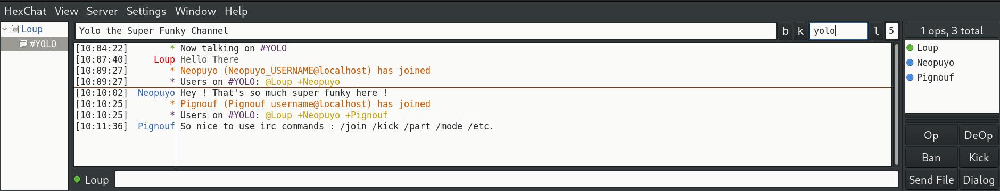
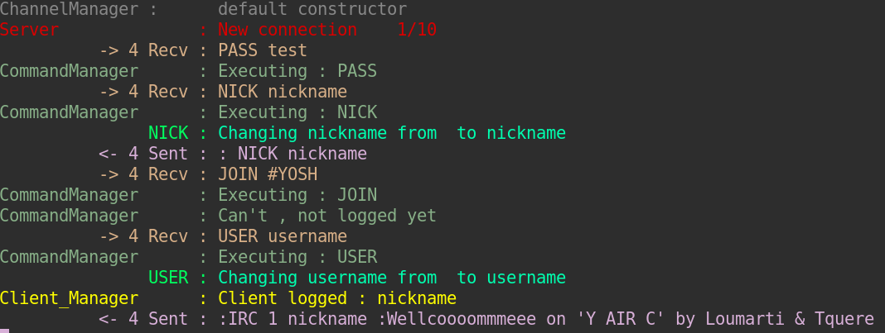

# IRC Server

This is the 42 team project <i>ft_irc</i>, an IRC server (Internet Relay Chat) written in <b>C++</b>. IRC is a text-based communication protocol on the Internet.
It offers real-time messaging that can be either public or private. Users can exchange
direct messages and join group channels.
IRC clients connect to IRC servers in order to join channels. IRC servers are connected
together to form a network.


## Launching server

The executable takes two arguments, the port and the password for the server.
to launch the server, run the following commands:

```bash
make
./ircserv 6667 test
```

## Connecting to the server

To connect to the server, you can use an IRC client like Hexchat.
Or directly using netcat command in a terminal:

```bash
nc localhost 6667
```
Then you have to give user information and password to get authentified.

```bash
PASS test
NICK myNickname
USER myUsername
```

## Commands

Once connected and authentified, you can use commands to interact with the server, create and manage channels, send messages, etc.

```bash
JOIN myChannel # a channel name must start with a '#' character
PRIVATEMSG myChannel myMessage
```
> Most command of IRC protocol are implemented in the server, you can find documentation about [here](https://www.rfc-editor.org/rfc/rfc2812)

## Logs

Each action is logged in the console who launched the server, each class/service using his own color to follow easily.

